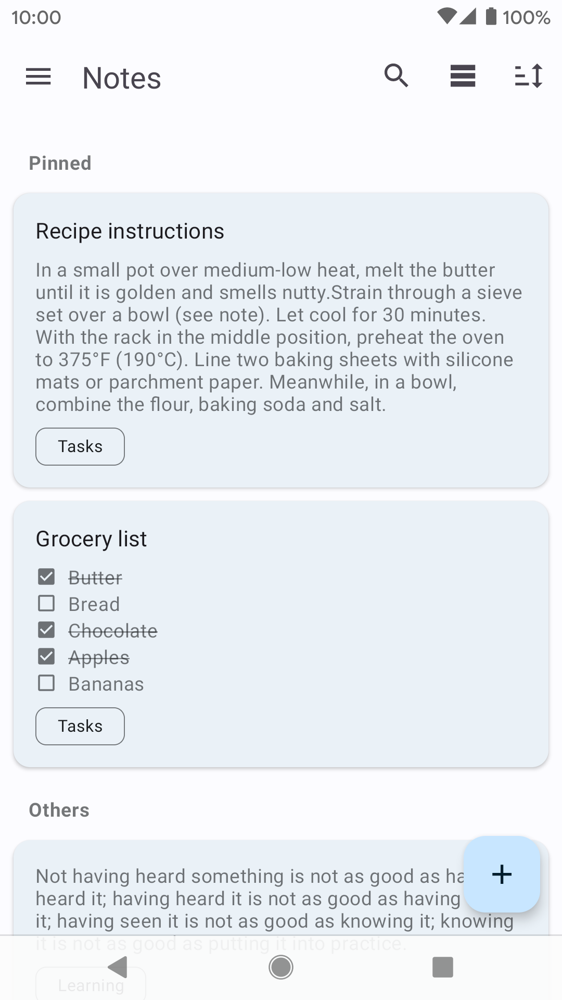

#   Notes

#### This is a simple Android app for taking notes.
#### The app has Material UI, was built following MVVM architecture, uses Dagger and some Jetpack components. Download coming soon!!

  
  

 

#### Features
- Text and list notes.
- Archive and recycle bin.
- Labeled notes.
- Reminders (including recurring).
- Searching notes.
- Light and dark theme support.
- Basic import and export.
- Somewhat customizable interface.
###### Planned features
- Colored notes
- Timestamps
- Markdown editing
- In-app update
- In-app language selection
- Better reminder grouping

## ⬇️ Installation

  

### 🔨 Building from source

This is the best way to ensure you're experiencing the latest preview features. However, this is experimental and certain functions may not work as intended.
See [this section](#-building-the-code).

### 📸 Screenshots

  

### 🆕 Changelog
[View changelog here][changelog] for the app release notes.

## 🔨 Building the Code
### 1️⃣ Prerequisites

Ensure you have following components:

- [Git](https://git-scm.com/)
- [Android Studio](https://developer.android.com/studio) with the following installed:
  - Android SDK
  - Android SDK Build-Tools 35.0.2
- Any operating system supported by Android Studio (Windows, macOS, Linux, ChromeOS)
- At least 8GB of RAM

### 2️⃣ Clone
Clone the repository by typing 'git clone' followed by the repo's url into your terminal.

### 3️⃣ Build
Build the app using Android Studio's built-in options or use the gradlew command line tool to build.

## 🧪 Contributing
Contributions are welcome, especially translations (you can submit translations on Crowdin of via a pull request!).
- Please open an issue before submitting a pull request that adds a new feature, so it can be
    discussed.
- Make sure to follow existing code style (see `config/intellij-codestyle.xml` file).

## ⚖️ License (and credits!)
- All code is licensed under Apache License 2.0.
- Icons were mostly found at [Material Design Icons][mdi-icons], license can be found
[here][mdi-icons-license].
- Thanks to the following contributors for translations:
    - Arabic: @afmbsr
    - Chinese: @Nriver
    - Dutch: Jeroen de Jong
    - German: @memyselfandi
    - Italian: carallo
    - Norwegian: @FTno
    - Polish: Sebastian Jasiński, @jpbandroid
    - Portuguese: Fabricio Duarte
    - Russian: Zakhar Timoshenko, PedroTashima
    - Spanish: Juan Carlos Vallejo, CyanWolf
    - Turkish: language_is_alive
    - Ukrainian: Andrij Mizyk

[changelog]: CHANGELOG.md
[translating]: TRANSLATING.md
[mdi-icons]: https://materialdesignicons.com
[mdi-icons-license]: https://github.com/Templarian/MaterialDesign#license
